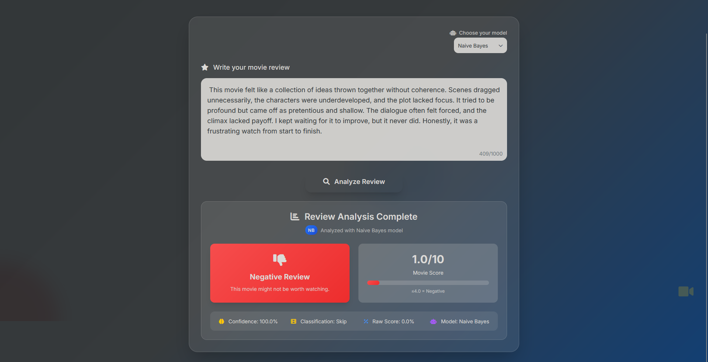

# 🎬 Movie Review Classifier
This is a movie review sentiment classifier built using both machine learning and deep learning techniques. It combines a fast Naive Bayes model with a context-aware BiLSTM to provide reliable classification. The tool runs locally and includes a simple, interactive web interface for input and results.

## ⚡ Features
- Utilizes the IMDB movie review dataset with predefined train/test splits  
- Text preprocessing includes lowercasing, punctuation removal, stopword filtering, tokenization, and lemmatization  
- Implements stratified 5-fold cross-validation for reliable model evaluation  
- Two sentiment classifiers:  
  - Naive Bayes – a lightweight, classical machine learning baseline  
  - BiLSTM – a custom-trained deep learning model with contextual understanding  
- BiLSTM achieves ~85.8% accuracy on the test set  
- Naive Bayes reaches ~82.3% accuracy  
- GPU support enabled for BiLSTM via PyTorch CUDA  
- Multithreading for faster data loading and preprocessing  
- Interactive web interface to input reviews and view results  
- Option to choose between models at runtime  
- Frontend built with HTML, Tailwind CSS, and JavaScript  
- Flask-based backend API  

## ⚙️ Technologies Used
- Text Processing: NLTK
- Model Training: Scikit-Learn + PyTorch
- Visualization: matplotlib
- Frontend: HTML + Tailwind CSS + JavaScript
- Backend: Python + Flask

## 🎞️ UI Snapshot

  

### Example Usage 

  
*BiLSTM - Postive Review.*


  
*BiLSTM - Negative Review.*


  
*BiLSTM - Neutral Review.*


  
*Naive Bayes - Postive Review.*


  
*Naive Bayes - Negative Review.*


  
*Naive Bayes - Neutral Review.*

## 🔧 Installation

1. **Clone the repo**  
   ```bash
   git clone https://github.com/ananyahegde/IMDB-movie-classifier.git
   cd IMDB-movie-classifier
   ```

2. **Create and activate a virtual environment (optional but recommended)**

    ```bash
    python -m venv venv
    source venv/bin/activate
    ```
    On windows:
    ```bash
    python -m venv venv
    venv\Scripts\activate
    ```

3. **Install dependencies**
    
    ```bash
    pip install -r requirements.txt
    ```

4. **Running the App**

    ```bash
    python app/server.py
    ```

    Then open your browser and go to:  
    http://localhost:5000


## 📄 License

[](LICENSE)

## 🤝 Contributions

PRs and suggestions are welcome.
